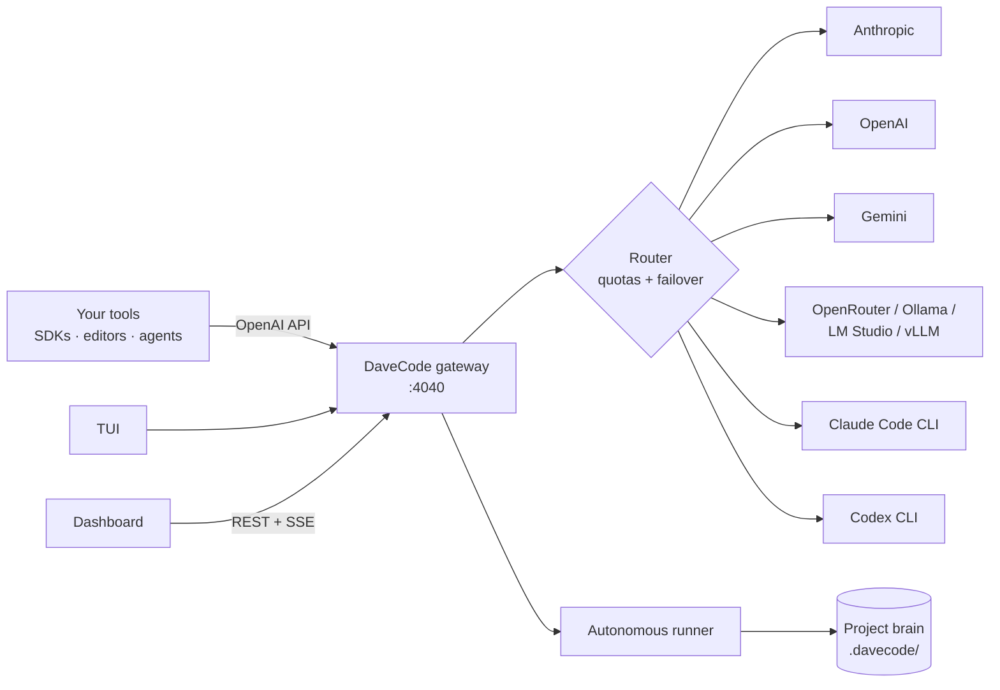
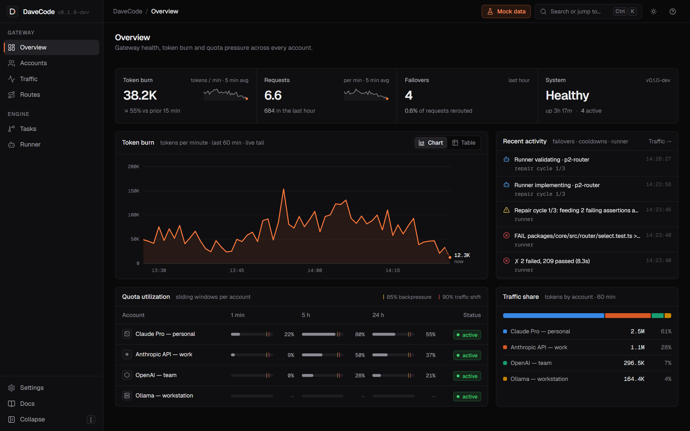
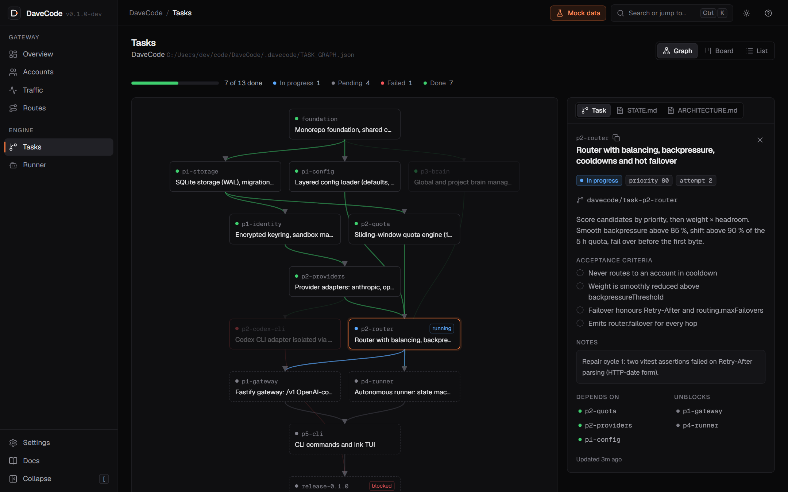
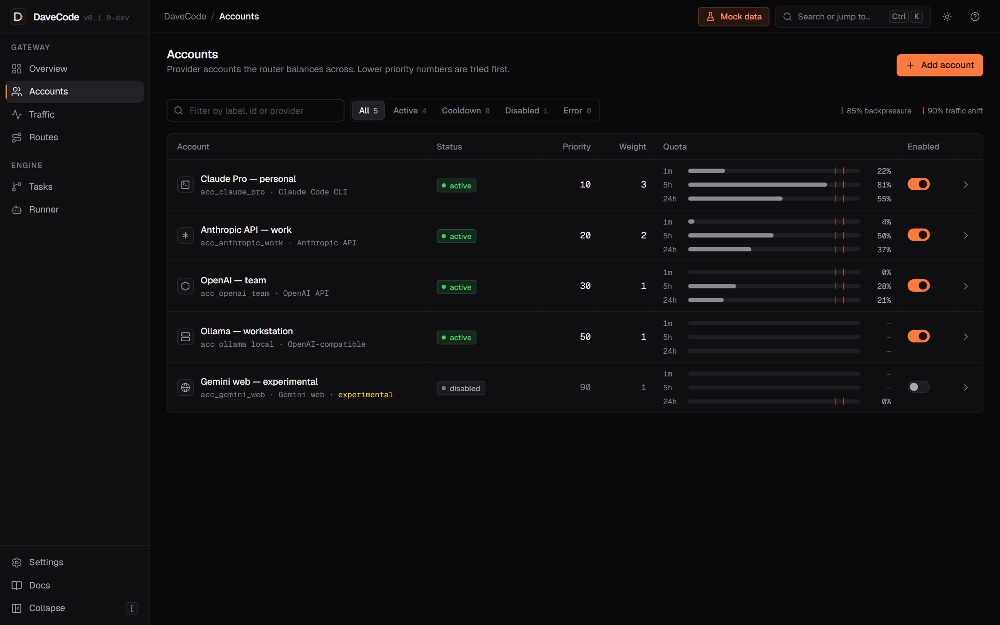

<div align="center">

# DaveCode

**Local-first autonomous software engineer and multi-provider AI gateway.**

One OpenAI-compatible endpoint in front of Claude, GPT, Gemini and your local models, with
quota-aware routing and hot failover, plus an engine that turns a task graph into tested,
merged code while you sleep.

[](https://github.com/DMRLZZ/DaveCode/actions/workflows/ci.yml)
[](LICENSE)


</div>

---

> [!WARNING]
> DaveCode is in **early development**. APIs and config may change between minor versions until
> `1.0`. See the [roadmap](#roadmap) for what already works.

## Why DaveCode?

You pay for several AI tools, and you still hit `429 Too Many Requests` in the middle of a
refactor, copy context between chat windows, and babysit agents that declare victory before the
tests pass. DaveCode fixes the plumbing:

- **One endpoint, every model.** Point any OpenAI SDK, editor or agent at
  `http://localhost:4040/v1` and use `davecode/auto`.
- **Never stall on a rate limit.** Sliding-window quota tracking (TPM, RPM, 5 h, 24 h) per
  account, smooth backpressure at 85 %, and hot failover to the next account or provider when an
  upstream returns `429`/`5xx`.
- **Isolated identities.** Each Claude Code / Codex account runs in its own sandboxed config
  directory; secrets are AES-256-GCM encrypted at rest and never leave your machine.
- **A brain that persists.** A global brain for your preferences plus a per-repo brain
  (`STATE.md`, `ARCHITECTURE.md`, `TASK_GRAPH.json`) injected into every task.
- **Autonomous, but accountable.** Each task runs on its own `davecode/task-<id>` branch and is only
  merged after your linters and tests pass, with up to three self-repair cycles. An optional
  judge ([TypeSafe Jev](https://www.llmreference.com/provider/typesafe-ai/jev) or any of your
  routes) checks acceptance criteria with calibrated confidence. The default is free,
  deterministic checks.
- **Terminal-first, with a cockpit.** A TUI in the spirit of Claude Code and opencode, plus a
  real-time web dashboard for token burn, failovers and task traces.

## How it works



Read the full design in [docs/ARCHITECTURE.md](docs/ARCHITECTURE.md) and the HTTP contract in
[docs/API.md](docs/API.md).

## Quick start

> Requires **Node.js 22.12+** and **pnpm 10+**. Published npm packages arrive with `v0.1.0`; until
> then, run from source.

```bash
git clone https://github.com/DMRLZZ/DaveCode.git
cd DaveCode
pnpm install
pnpm build
```

`pnpm build` also builds the CLI. Put `davecode` on your PATH (or run
`node packages/cli/bin/davecode.js`; `pnpm --filter davecode dev <command>` runs from source):

```bash
alias davecode="node $PWD/packages/cli/bin/davecode.js"   # or: cd packages/cli && npm link

davecode doctor                     # checks Node, SQLite, ports, git/claude/codex/gh, Ollama
davecode accounts add               # interactive: provider, label, priority, masked API key
davecode start                      # gateway on :4040 + dashboard at http://localhost:4040/
davecode status                     # health, accounts and 1m/5h/24h quota bars (--json too)
davecode                            # chat TUI in your terminal (same as `davecode chat`)
```

Scripts can skip the prompts:

```bash
davecode accounts add --provider anthropic --label work --secret-env ANTHROPIC_API_KEY --yes
davecode accounts add --provider openai-compatible --label ollama \
  --base-url http://localhost:11434/v1 --model qwen3:32b --yes
davecode accounts add --provider claude-cli --label "Claude Pro" --yes
davecode accounts login <id>        # logs that account in inside its own CLAUDE_CONFIG_DIR
```

Point DaveCode at a repository and let it work through the task graph:

```bash
cd ~/code/my-app
davecode init                       # .davecode/ brain + runner.validate from package.json
davecode tasks add api "Add the /health endpoint" --acceptance "GET /health returns 200"
davecode tasks                      # task tree with status glyphs and blocked reasons
davecode run --once                 # implement the next task, validate, repair, merge
davecode run                        # 24/7 loop with a live runner view; Ctrl+C stops safely
```

Other commands: `davecode config show|path|get <key>` (secrets redacted), `davecode tasks next`,
`davecode tasks status <id> <STATUS>`, `davecode accounts list|enable|disable|remove`. Global
flags: `--home <dir>` (sets `DAVECODE_HOME`), `--json`, `--no-color` (and `NO_COLOR`).

In the chat TUI, Enter sends, Shift+Enter or Ctrl+J adds a line, Esc cancels a reply and
Ctrl+C twice exits. Slash commands: `/model`, `/route`, `/accounts`, `/tasks`, `/status`,
`/clear`, `/help`, `/exit`. The status line shows the model, the account that served the last
reply, failovers, tokens and the 5 h quota. Without a running gateway the TUI starts one
in-process.

Any OpenAI-compatible client works against the gateway:

```ts
import OpenAI from 'openai';

const client = new OpenAI({ baseURL: 'http://localhost:4040/v1', apiKey: 'unused-locally' });

const res = await client.chat.completions.create({
  model: 'davecode/auto',
  messages: [{ role: 'user', content: 'Explain this stack trace…' }],
});
```

## Dashboard

A keyboard-first web cockpit for the gateway and the autonomous engine (`packages/ui`, Vite +
React + Tailwind). The gateway serves its production build (`packages/ui/dist`) at
`http://localhost:4040/`.



| Task graph | Accounts |
| :--------: | :------: |
|  |  |

- **Overview**: live token burn (tokens/min over 60 min), requests/min, failovers, health and
  per-account 1m/5h/24h quota meters with the 85 % backpressure and 90 % shift thresholds.
- **Accounts, Traffic, Routes**: add accounts with write-only secrets, watch every request with
  its failover chain inline (`acc A → 429 → acc B ✓`), inspect ordered route targets.
- **Tasks and Runner**: the task graph as a DAG, board or list next to `STATE.md`, and the
  runner's state machine, repair cycles and live logs with start/pause/stop.
- `Ctrl/⌘ K` opens the command palette; `g o`, `g a`, `g t`… jump between screens; `?` lists
  every shortcut. Dark by default, with a light theme.

Develop it against a running gateway, or fully offline with simulated data:

```bash
pnpm dev:ui                     # http://localhost:5173, proxies /api and /v1 to :4040
# open http://localhost:5173/?mock=1 for mock mode (or set VITE_DAVECODE_MOCK=1)
```

When the gateway is unreachable the dashboard falls back to mock data automatically and shows a
**Mock data** badge. The screenshots above were taken in mock mode.

## Providers

| Provider | Kind | Auth | Default |
| :------- | :--- | :--- | :------ |
| Anthropic API | `anthropic` | API key | ✅ |
| OpenAI API | `openai` | API key | ✅ |
| Google Gemini API | `gemini` | API key | ✅ |
| OpenRouter, Ollama, LM Studio, vLLM, LiteLLM… | `openai-compatible` | Optional key + base URL | ✅ |
| Claude Code CLI | `claude-cli` | Your Claude login, isolated per account | ✅ |
| Codex CLI | `codex-cli` | Your ChatGPT/OpenAI login, isolated per account | ✅ |
| Gemini web session | `gemini-web` | Browser profile | ⚠️ Experimental, off |

### Terms of Service

DaveCode's original specification includes two capabilities that automate consumer products in
ways their providers may prohibit:

- driving a **Gemini web session** through Chromium (`experimental.geminiWeb`), and
- **rotating several subscription logins** of the same provider to get around per-account limits
  (`experimental.multiAccountRotation`).

Both are **disabled by default**. If you turn them on, you accept the risk of your accounts being
rate-limited or suspended by the provider. API-key providers and cross-provider failover are not
affected.

## Configuration

DaveCode merges built-in defaults, `~/.davecode/config.json`, `<repo>/.davecode/config.json` and
environment variables. A minimal example:

```json
{
  "routing": {
    "routes": [
      {
        "name": "auto",
        "targets": [
          { "provider": "anthropic", "model": "claude-sonnet-5-5" },
          { "provider": "openai", "model": "gpt-5.5" },
          { "provider": "openai-compatible", "model": "qwen3:32b" }
        ]
      }
    ]
  },
  "runner": {
    "validate": { "lint": "pnpm lint", "typecheck": "pnpm typecheck", "test": "pnpm test" },
    "judge": { "kind": "none" }
  }
}
```

The full schema with documentation lives in
[`packages/core/src/config/schema.ts`](packages/core/src/config/schema.ts).

## Project layout

```
packages/
├── core/     @davecode/core: contracts, storage, identity, quotas, providers, router, brain, runner
├── server/   @davecode/server: Fastify gateway (/v1 proxy, /api, SSE), serves the dashboard
├── cli/      davecode: CLI commands and the Ink TUI
└── ui/       @davecode/ui: Vite + React + Tailwind dashboard
docs/         architecture, API contract, original spec
.davecode/    DaveCode's own project brain (we dogfood it)
```

## Roadmap

- [x] **Foundation:** monorepo, shared contracts, config schema, CI
- [ ] **Phase 1, gateway & identity:** SQLite storage, encrypted keyring, sandbox manager,
  OpenAI-compatible gateway
- [ ] **Phase 2, quotas & router:** sliding windows, provider adapters, hot failover
- [ ] **Phase 3, dual brain:** global/project brain, task graph DAG with cycle detection
- [ ] **Phase 4, autonomous loop:** runner state machine, validator, repair cycles, git flow, judge
- [ ] **Phase 5, interfaces:** web dashboard, CLI and TUI
- [ ] **v0.1.0:** npm release

## Contributing

Contributions are welcome. Read [CONTRIBUTING.md](CONTRIBUTING.md) to get set up, and please follow
our [Code of Conduct](CODE_OF_CONDUCT.md). Security issues go through [SECURITY.md](SECURITY.md),
not public issues.

## License

[MIT](LICENSE) © DaveCode contributors
