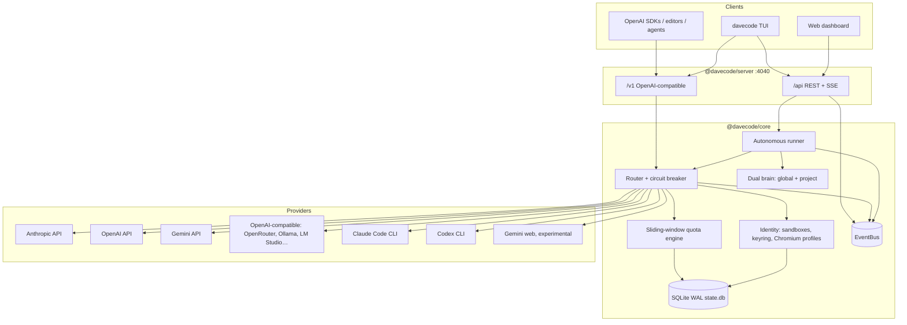
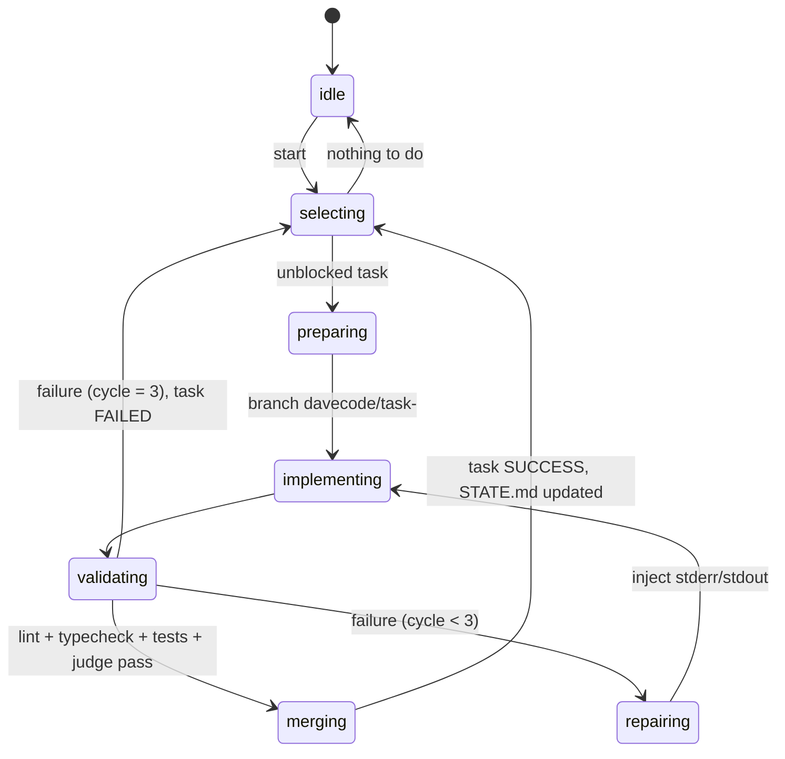

# Architecture

DaveCode is a **local-first** engine with two jobs:

1. **Gateway**: an OpenAI-compatible proxy (`/v1`) that routes every request to the best
   available account across providers, tracks quotas in sliding windows and fails over on
   `429`/`5xx` before the client ever notices.
2. **Autonomous engineer**: a runner that walks a task DAG, implements each task on an isolated
   git branch, validates it with your linters/tests (plus an optional judge), self-repairs up to
   three times and merges.

Everything runs on your machine. State lives in `~/.davecode` (global) and `<repo>/.davecode`
(per project).



## Packages

| Package | Responsibility |
| :------ | :------------- |
| [`@davecode/core`](../packages/core) | Domain contracts, config, SQLite storage, keyring, sandboxes, quota engine, providers, router, dual brain, task graph, autonomous runner |
| [`@davecode/server`](../packages/server) | Fastify gateway: `/v1` proxy, `/api` REST, SSE event stream, serves the built dashboard |
| [`davecode`](../packages/cli) | The published CLI (`davecode start`, `status`, `add-account`, `run`) and the Ink-based TUI |
| [`@davecode/ui`](../packages/ui) | Vite + React + Tailwind dashboard (dark by default) |

Dependency direction is strictly `cli → server → core` and `ui → (HTTP) → server`. `core`
never imports from the other packages.

### `@davecode/core` layout

```
src/
├── types.ts            # shared contracts (source of truth for docs/API.md)
├── errors.ts           # ProviderError + failover classification
├── events.ts           # typed EventBus with replay buffer
├── paths.ts            # ~/.davecode and <repo>/.davecode layout
├── config/             # zod schema + layered loader
├── storage/            # better-sqlite3 (WAL), migrations, repositories
├── identity/           # sandbox.ts, keyring.ts, chromium.ts
├── rate-limiter/       # window.ts (sliding windows), tracker.ts (SQLite-backed)
├── providers/          # one adapter per ProviderKind
├── router/             # account selection, balancing, hot failover, circuit breaker
├── brain/              # global.ts, project.ts, graph.ts (DAG resolver)
└── autonomous/         # runner.ts, executor.ts, tools.ts, validator.ts, git.ts, judge.ts
```

## Key design decisions

| Decision | Choice | Why |
| :------- | :----- | :-- |
| Runtime | Node.js ≥ 22.12, ESM | Widest contributor reach; Node 20 is EOL |
| Repo | pnpm workspaces monorepo | Clear package boundaries, one lockfile |
| Storage | SQLite (WAL) via `better-sqlite3` | Synchronous, fast, multi-process safe, zero ops |
| Secrets | AES-256-GCM, per-install master key in `~/.davecode/master.key` (0600) | Encryption at rest without an external KMS |
| Validation | zod | One schema for config, API bodies and task graphs |
| Token counting | `js-tiktoken` (pure JS) | No native build; good-enough estimates when upstream omits usage |
| Gateway | Fastify 5 | Fast, typed, first-class streaming |
| Live updates | Server-Sent Events | One-way stream is all the dashboard needs, proxies well |
| UI | TUI (Ink) + web dashboard (Vite/React/Tailwind) | Terminal-first like Claude Code/opencode, rich observability in the browser |
| Judge | Deterministic checks by default; optional TypeSafe Jev or any LLM route | Free by default, calibrated confidence when you want it |

## Routing & quotas

Each account is tracked in four sliding windows: **TPM** and **RPM** (60 s), **5 h** and
**24 h**. Selection for a request:

1. Resolve the candidate list from the route (`davecode/auto`), provider prefix or bare model.
2. Drop accounts that are disabled, cooling down, or whose window would overflow.
3. Score the rest: priority first, then weight × headroom. Above **85 %** utilization an account's
   weight is smoothly reduced (backpressure); above **90 %** of its 5 h quota traffic shifts to
   alternates.
4. Call the provider. On `rate_limit`, `quota_exhausted`, `unavailable`, `timeout`, `network`
   or `context_length`, put the account in cooldown (honouring `Retry-After`), emit
   `router.failover` and immediately try the next candidate, up to `routing.maxFailovers`.
   (`context_length` fails over without a cooldown, since the prompt rather than the account is
   at fault.) `auth` errors never fail over and mark the account `error`; a per-account circuit
   breaker skips accounts after repeated consecutive failures until a half-open probe succeeds.

Subscription providers (`claude-cli`, `codex-cli`, `gemini-web`) only rotate across multiple
accounts of the same provider when `experimental.multiAccountRotation` is enabled.

## Identity isolation

- **CLI providers**: each account gets `~/.davecode/sandboxes/<accountId>/`, passed to the child
  process as `CLAUDE_CONFIG_DIR` (Claude Code) or `CODEX_HOME` (Codex). Accounts never share
  credentials, caches or rate-limit state.
- **Browser providers** (experimental): a dedicated Chromium `userDataDir` under
  `~/.davecode/profiles/<accountId>/`. `playwright-core` is an optional peer dependency.
- **Secrets**: stored in the `secrets` table encrypted with AES-256-GCM. Secrets are write-only
  through the API and never appear in events or logs.

## Dual brain

```
~/.davecode/brain/          GLOBAL USER BRAIN: preferences, coding patterns (markdown)
<repo>/.davecode/
├── STATE.md                current progress, blockers
├── ARCHITECTURE.md         system patterns, dependencies, stack
└── TASK_GRAPH.json         DAG of tasks: PENDING | IN_PROGRESS | SUCCESS | FAILED
```

The task graph is validated on read and on write (`parseTaskGraph`): duplicate ids, unknown
dependencies, self-dependencies and cycles are rejected, and cycle errors name the path
(`a → b → c → a`). The next task is the highest-priority `PENDING` node whose dependencies are
all `SUCCESS`; ties keep file order. Status changes are immutable updates that follow
`PENDING → IN_PROGRESS → SUCCESS | FAILED | PENDING`, `FAILED → PENDING` (retry) and
`SUCCESS → PENDING` (reopen); entering `IN_PROGRESS` increments `attempts`.

Module map (`packages/core/src/brain/`):

| Module | Responsibility |
| :----- | :------------- |
| `graph.ts` | zod schema, DAG validation, `nextTask`/`readyTasks`/`blockedTasks`, `summarize`, `updateTask`/`setTaskStatus` |
| `project.ts` | `ProjectBrain`: scaffold, read/write STATE.md, ARCHITECTURE.md and the graph, `task.updated` events |
| `markdown.ts` | level-2 section parser behind `updateStateSection` and `appendStateLog` (fence-aware, preserves other content) |
| `lock.ts` | `.davecode/.lock` (`{ pid, ts }`, stale after 30 s) serialising read-modify-write cycles between the runner and the dashboard |
| `global.ts` | `GlobalBrain`: flat markdown notes in `~/.davecode/brain/`, names sanitised, no path traversal |
| `context.ts` | `buildTaskContext` and `DAVECODE_SYSTEM_PROMPT` |

All writes are atomic (temp file + rename). `buildTaskContext` emits, in order, `GLOBAL BRAIN`,
`PROJECT ARCHITECTURE`, `PROJECT STATE` and `CURRENT TASK` sections. Over budget (default
60 000 characters) it cuts the least important material first: global notes, then the oldest
STATE.md activity-log entries, then the rest of STATE.md, and ARCHITECTURE.md only as a last
resort. Every cut is marked `[… truncated to fit the context budget]` and the task section is
never truncated. Add `.davecode/.lock` to a project's `.gitignore`.

## Autonomous loop



Any step can also move to `paused` (`pause()`, honoured at the next step boundary; in-flight
work finishes first), `stopped` (`stop()`) or `error` (unexpected failure). `idle` doubles as the
24/7 polling state: with no ready task the loop sleeps `runner.idlePollMs` and selects again.

Module map (`packages/core/src/autonomous/`):

| Module | Responsibility |
| :----- | :------------- |
| `runner.ts` | `AutonomousRunner` state machine; structurally satisfies the gateway's `RunnerControl` |
| `create.ts` | `createRunner(engine, { brain })` / `createExecutor(engine)` wiring from `runner.*` config |
| `executor.ts` | `Executor` interface and the default `builtin` tool loop over the router |
| `claude-cli-executor.ts` | Opt-in `claude-cli` delegation (`claude -p` with the account's `CLAUDE_CONFIG_DIR`) |
| `tools.ts` | `list_dir`, `read_file`, `write_file`, `edit_file`, `search`, `run_command`, `finish` with repo path confinement |
| `validator.ts` | Runs `runner.validate.{lint,typecheck,test}` and renders the `ValidationReport` |
| `judge.ts` | `none` / `jev` (OpenRouter Decisions API) / `llm` acceptance judges |
| `git.ts` | `execFile('git')` wrapper: branches, commits, `merge --no-ff`, PR mode |
| `process.ts` | Quote-aware argv splitter, Windows `.cmd` shim rules, tail-first output capture |

One task, step by step:

1. **Preflight** (`start()` / `runOnce()`): inside a git work tree, brain initialised, base branch
   exists, working tree clean (changes under `.davecode/` are ignored because the runner and the
   dashboard write there). Otherwise the runner refuses with `RunnerError` (gateway: `409`).
2. **Select** `nextTask(graph)` (or the task named by `runOnce({ taskId })` / `start({ taskId })`,
   which must be PENDING with all dependencies SUCCESS, checked by `checkRunnable`), set it `IN_PROGRESS` (attempts + 1, `branch` recorded) and append
   to the STATE.md activity log.
3. **Prepare** `runner.branchPrefix + id` from `runner.baseBranch`. A branch left by an earlier
   failed attempt is renamed `…-attempt-<n>` first.
4. **Implement** with the executor. The `builtin` executor starts from `DAVECODE_SYSTEM_PROMPT`
   plus task instructions plus `buildTaskContext`, calls the router with OpenAI tools, and stops
   on `finish`, `runner.maxIterations` round-trips per pass or `runner.maxTaskTokens` per task.
   Tool paths are confined to the repo (no absolute paths outside it, no `..` or symlink
   escapes, no `.git`, `.davecode` read-only); `run_command` uses `execFile` with
   `runner.allowedCommands` (git limited to read-only subcommands).
5. **Validate** each configured command (no shell, `node_modules/.bin` on PATH,
   `runner.commandTimeoutMs`), keeping the tail of stdout/stderr. If the checks pass, the change
   is staged (brain excluded); an empty change counts as a failure. Then the **judge** runs.
6. **Repair**: on a failed check or a judge rejection, the report (exact output, truncated) is
   appended to the same executor session, up to `runner.maxRepairCycles`. Judge errors (for
   example a missing `OPENROUTER_API_KEY`) fail the task without merging.
7. **Merge**: Conventional Commit (`feat: <title>`, summary body, `DaveCode-Task: <id>` trailer)
   on the task branch, `merge --no-ff` into the base branch and delete the branch. With
   `runner.pullRequests` the branch is pushed (never forced) and opened with `gh pr create`;
   without `gh` or a remote it falls back to a local merge with a warning. The task becomes
   `SUCCESS` and STATE.md / TASK_GRAPH.json are committed on the base branch
   (`runner.commitBrain`).
8. **Failure**: the attempt is committed on its branch (`--no-verify` snapshot) and kept for
   inspection, the runner returns to the base branch and the task becomes `FAILED` with the
   reason and the last report in `notes`. `stop()` aborts the in-flight model call or command
   through an `AbortSignal`, parks partial work the same way and sets the task back to `PENDING`.

Every transition emits `runner.status`; progress lines (tool names and paths, check results,
never file contents or secrets) are emitted as `runner.log`.

## Experimental & Terms-of-Service-sensitive features

Two capabilities described in the [original specification](SPEC.md) automate consumer
products in ways their providers may prohibit. They ship **disabled** and require an explicit
opt-in in `config.json`:

| Flag | Enables | Risk |
| :--- | :------ | :--- |
| `experimental.geminiWeb` | The `gemini-web` provider (Chromium-driven Gemini web session) | Likely violates Google's ToS; accounts can be suspended |
| `experimental.multiAccountRotation` | Balancing across several subscription logins of one provider | May violate Anthropic/OpenAI consumer terms; accounts can be suspended |

API-key providers and cross-provider failover are unaffected by these flags.
